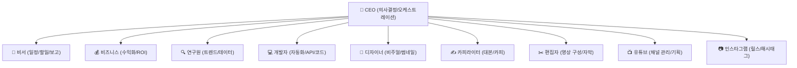
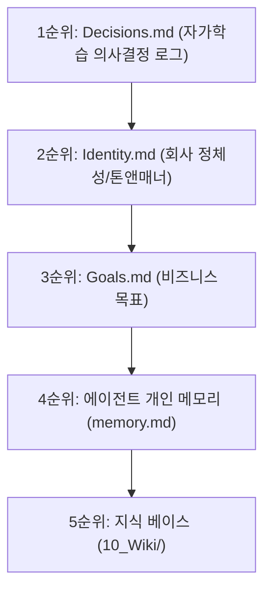
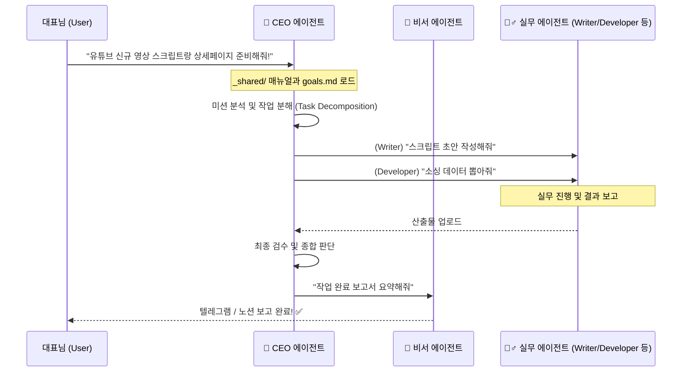

# 🧬 다다직구(dadajikgu) 1인 기업 OS 에이전트 팀 구동 가이드 (E:\work 원본)

안녕하세요, 대표님! 다다직구의 든든한 10대 AI 에이전트 팀들이 어떻게 유기적으로 움직이고 비즈니스를 돕는지 한눈에 쏙 들어오게 정리해 드립니다! 🚀

---

## 🌟 10대 에이전트 팀의 역할 분담

우리 기업의 든든한 임직원들을 소개합니다! 각 분야의 최고 전문가들이 모여 대표님의 비즈니스를 초고속으로 성장시킵니다.

| 에이전트 | 주요 역할 |
| :--- | :--- |
| 🧭 **CEO** | 전체 에이전트 오케스트레이션, 작업 분해, 최종 의사결정 및 다음 행동 지시 |
| 📱 **Secretary (비서)** | 데일리 일정 관리, 다른 에이전트 업무 요약 및 **텔레그램 알림 보고** |
| 💰 **Business (비즈니스)** | 수익화 모델 계산, B2B 제안서 기획, 인프라 비용 절감 ROI 분석 |
| 🔍 **Researcher (연구원)** | 구매대행/소싱 트렌드 리서치, 경쟁사 분석 및 팩트 체크 |
| 💻 **Developer (개발자)** | 엑셀 주문서 번역 매크로, API 연동, 자동화 데이터 파이프라인 개발 |
| 🎨 **Designer (디자이너)** | 썸네일 컨셉, 브랜드 비주얼 시스템 및 가이드라인 설계 |
| ✍️ **Writer (카피라이터)** | 유튜브/릴스 스크립트 초안 작성, 블로그 글 및 상세페이지 카피라이팅 |
| ✂️ **Editor (편집자)** | 영상 컷 편집 디렉션, B-roll 제안, 자막 타이틀 및 최종 검수 |
| 📺 **YouTube (유튜브)** | 유튜브 채널 운영 전략 수립, 영상 기획서(제목·후크) 구성, 트래픽 유입 기획 |
| 📷 **Instagram (인스타그램)** | 인스타 릴스/피드 컨셉, 해시태그 전략 및 팔로워 소통 관리 |

---

## ⚙️ 에이전트 팀의 구동 방식 (엔진)

에이전트들이 엉뚱한 행동을 하지 않고, 대표님의 비즈니스 목표에 맞게 정확히 구동되는 핵심 메커니즘입니다.

### 1. 두뇌의 기어: AI 모델 튜닝 (`agent_models.json`)
각 에이전트의 업무 성격과 연산 난이도에 따라 가장 효율적인 두뇌(LLM)가 매칭되어 작동합니다!

*   **🧠 최고사양 의사결정 엔진 (`google/gemma-4-e2b`)**:
    *   **CEO** (전체 오케스트레이션), **Designer** (비주얼 디렉팅) 처럼 고도의 판단력과 창의성이 필요한 포지션에 투입됩니다.
*   **⚡ 초고속 실무 처리 엔진 (`qwen3.5-4b`)**:
    *   **Secretary**, **YouTube**, **Researcher**, **Business**, **Writer**, **Editor**, **Instagram** 등 텍스트 처리, 단순 요약, 데이터 정리가 위주인 실무 포지션에 매칭되어 비용은 최소화하고 처리 속도는 극대화합니다.

---

### 2. 에이전트의 기억 장치 및 위계질서 (`Memory Hierarchy`)
의사결정을 내릴 때 정보의 충돌을 방지하기 위해 다음과 같은 엄격한 **메모리 우선순위(위계)**를 따릅니다.

1.  **`_shared/decisions.md` (1순위 - 가장 강력함)**: 에이전트들이 활동하면서 축적된 핵심 의사결정 로그(자가학습 데이터)입니다.
2.  **`_shared/identity.md` (2순위)**: 회사의 이름, 톤앤매너, 핵심 가치입니다.
3.  **`_shared/goals.md` (3순위)**: 우리가 달성해야 하는 최우선 비즈니스 목표입니다.
4.  **`_agents/<id>/memory.md` (4순위)**: 각 에이전트가 직접 업무를 보며 학습한 개인별 append-only 자가 메모리입니다.
5.  **`10_Wiki/` (5순위)**: 전체 공유 지식 베이스 아카이브입니다.

---

### 3. 유기적인 세션 작업 흐름 (`Workflow`)

대표님이 미션을 주시면 다음과 같은 흐름으로 구동됩니다.

1.  **작업 생성**: 대표님이 요청이 들어오면 `🧭 CEO`가 전체 시스템을 지휘합니다.
2.  **협업 세션 저장**: 모든 작업 과정과 결과물은 `sessions/<타임스탬프>/` 폴더에 자동으로 고스란히 기록되어 언제든 꺼내볼 수 있습니다.
3.  **안전한 백업 및 동기화 (Git Sync)**:
    *   에이전트의 영혼과도 같은 `memory.md`, `prompt.md` 그리고 `sessions/`는 **자동으로 Git에 동기화**되어, 컴퓨터를 바꾸더라도 로그인 한 번으로 모든 에이전트 팀이 즉시 100% 복구됩니다!
    *   대표님의 소중한 API 키나 패스워드가 담긴 `config.md`와 캐시 폴더는 자동으로 동기화에서 제외(`.gitignore`)되므로 보안도 완벽합니다. 👍
